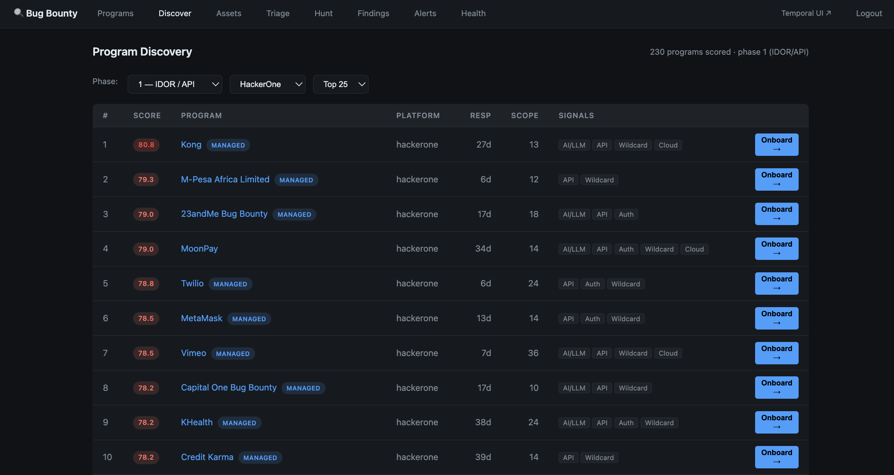
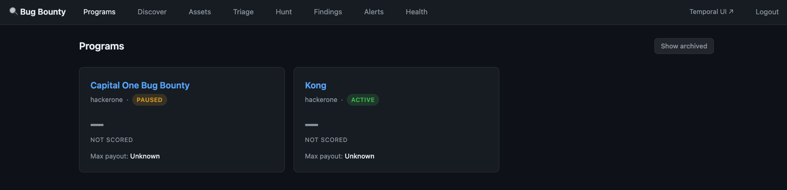
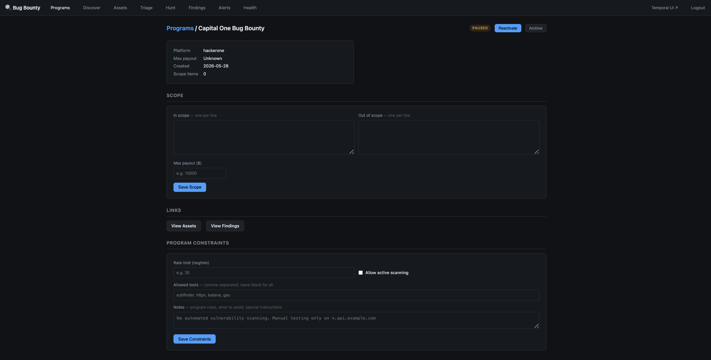
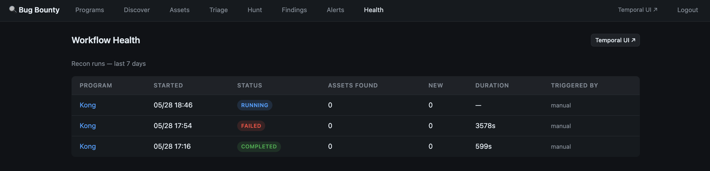
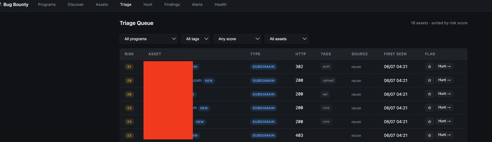
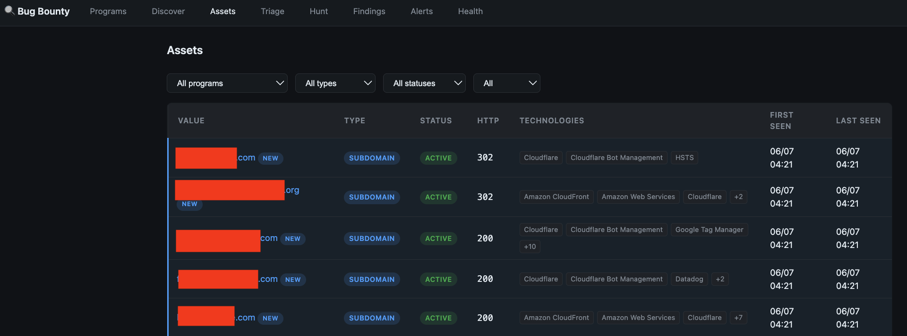

# BountyOS — Human-in-the-Loop Bug Bounty Research Platform

A personal, structured platform for ethical bug bounty research. Built as a guided hunting workflow — not an autonomous scanner. Tools collect leads, humans decide what matters.

> **Philosophy:** Depth over breadth. One to three programs, deeply mapped. Find what automated tools miss — logic flaws, broken authorization, and chained vulnerabilities that require human reasoning.

---

## Screenshots

**Program Discovery — 230+ programs scored by phase**


**Program Dashboard — programs with status badges, scores, and onboard/pause/archive controls**


**Program Detail — scope editor, constraints, recon history, and status controls**


**Workflow Health — recon run history with live status, duration, and asset counts**


**Triage Queue — assets ranked by risk score**
<!--  -->

**Finding Pipeline — kanban by status**
<!--  -->

**Asset Detail — notes, findings, tech stack**
<!--  -->

---

## Status

**V1 Complete + Hunter Decision Layer in progress.**

| Layer | Status |
|---|---|
| Infrastructure (Docker, Temporal, PostgreSQL) | Done |
| Recon workflows (subfinder, httpx, katana, gau, gowitness) | Done |
| Dashboard (programs, assets, findings, alerts) | Done |
| CI pipeline (gitleaks, Snyk, Semgrep, pytest) | Done |
| Safety hardening (scope enforcement, confidence scoring) | Done |
| MCP server (Claude Code reads live DB) | Done |
| Risk scoring + triage queue | Done |
| Hunt sessions + checklist engine | In progress |
| Report export (markdown, HackerOne format) | Planned |
| Feedback loop UI | Planned |

See [PROGRESS.md](PROGRESS.md) for full build history.

---

## How It Works

```
Program Intake      → discover from 230+ scored programs, onboard with one click
      ↓
Program Lifecycle   → active (hunting) → paused (on hold) → archived (done)
      ↓
Scope Guard         → validate_target() blocks out-of-scope before any storage
      ↓
Passive Recon       → subfinder, gau, crt.sh, GitHub Search, SecurityTrails, Whoxy
      ↓
Active Recon        → httpx, katana, gowitness, nuclei (scope-confirmed only)
      ↓
Asset Inventory     → normalized table: value, type, risk_score, tags, source_tool
      ↓
Triage Queue        → assets ranked by risk score, flagged by hunter
      ↓
Hunt Session        → structured session: hypothesis, checklist, notes, findings
      ↓
Checklist Testing   → IDOR / BAC / JWT / API checklists surfaced by asset tags
      ↓
Finding Builder     → title, impact, steps to reproduce, evidence, severity
      ↓
Report Export       → markdown / HackerOne / Bugcrowd format (coming)
      ↓
Feedback Loop       → outcome recorded, playbook updated (coming)
```

---

## Safety First

Every layer has a human gate. This platform cannot autonomously exploit anything.

| Gate | Where | What it does |
|---|---|---|
| Ethics checklist | Manual, pre-onboarding | Human confirms authorization |
| Scope enforcement | `validate_target()` in store_assets | Out-of-scope assets dropped before DB write |
| Program status check | ReconWorkflow | Refuses to run if program is not active |
| Confidence scoring | findings.confidence_score | Human assigns 0–100% before submitting |
| No autonomous exploitation | Architecture | MCP is read-only, LLM cannot trigger actions |
| API key auth | Dashboard | SHA-256 hashed, localhost-only binding |

See [SECURITY.md](SECURITY.md), [ETHICS.md](ETHICS.md), and [SCOPE_POLICY.md](SCOPE_POLICY.md).

---

## Stack

Built entirely on free and open source tools. Runs locally — no cloud, no monthly bills.

| Component | Technology |
|---|---|
| Language | Python 3.12 |
| Workflow engine | Temporal OSS |
| Database | PostgreSQL 15 |
| ORM + migrations | SQLAlchemy 2.0 + Alembic |
| Dashboard | FastAPI + Jinja2 |
| AI interface | Claude Code + MCP server (read-only) |
| Passive recon | subfinder, gau, crt.sh (coming) |
| Active recon | httpx, katana, gowitness, nuclei, truffleHog |
| Security scanning | Snyk + Semgrep + gitleaks |
| CI | GitHub Actions |
| Infra | Docker Compose (local Mac mini) |

---

## Quick Start

```bash
# First time setup
python3 -m venv .venv && .venv/bin/pip install -r requirements.txt
cp .env.example .env   # edit DB password if needed

# Start everything (generates API key automatically)
bash scripts/start.sh

# Or start with your own key
bash scripts/start.sh mypassword

# Stop worker and dashboard (leaves Docker running)
bash scripts/stop.sh
```

Dashboard: `http://localhost:8000` (login once — 7-day cookie)
Temporal UI: `http://localhost:8080`

---

## Importing Recon Output

If you run recon tools externally (OSINT platforms, Kali VM), import results directly:

```bash
# List programs in your database
python scripts/import_recon.py --list

# Import a file (format auto-detected: subfinder, httpx, katana, plain text)
python scripts/import_recon.py --program "Kong" --file subfinder.json

# Dry run first to preview what would be imported
python scripts/import_recon.py --program "Kong" --file results.json --dry-run

# Import a whole directory
python scripts/import_recon.py --program "Kong" --dir /shared/recon/
```

---

## Project Structure

```
src/
  workflows/        4 Temporal workflows (onboarding, recon, monitor, finding)
  activities/
    recon/          subfinder, httpx, katana, gau, gowitness runners
    storage/        store_assets (scope-enforced), scope validator
    scoring/        risk_score calculator, auto-tagger
    notifications/  Discord webhook alerts
  api/
    routers/        programs (discover, onboard, status), assets, triage, hunt,
                    findings, alerts, notes, health
    templates/      Jinja2 HTML templates
    static/         Dark terminal CSS
  mcp/              Read-only MCP server for Claude Code
  db/
    models/         9 SQLAlchemy table models
    session.py      Database connection

scripts/
  start.sh          Start Docker, worker, dashboard (generates API key on first run)
  stop.sh           Stop worker and dashboard
  import_recon.py   Import recon output from external tools
  select_program.py Score and rank bug bounty programs from bounty-targets-data
  fetch_osint.py    Passive OSINT — crt.sh, URLScan, GitHub, SecurityTrails, Whoxy

specializations/
  idor-api/         Phase 1 — IDOR + API security playbook (active)
  oauth-auth/       Phase 2 — OAuth + authentication playbook
  ai-llm/           Phase 3 — AI/LLM security playbook

core/
  methodology.md    8-step research process
  ethics-checklist.md   Run before every engagement
  report-template.md    Standard report structure

tests/              Smoke tests (pytest)
.github/workflows/  CI pipeline (ci.yml)
```

See [CODE_ARCHITECTURE.md](CODE_ARCHITECTURE.md) for a full layer-by-layer breakdown.

---

## Specializations

| Phase | Focus | Status |
|---|---|---|
| Phase 1 | IDOR + API Security | Active |
| Phase 2 | OAuth + Authentication | After first paid finding |
| Phase 3 | AI/LLM Security | After Phase 2 |

---

## CI Pipeline

Every push runs 4 automated checks:

| Check | Tool | What it catches |
|---|---|---|
| Secret scanning | gitleaks | Accidentally committed passwords or API keys |
| Code security | Snyk Code | Security vulnerabilities in Python code |
| Static analysis | Semgrep | Additional security issues |
| Tests | pytest | Broken imports, smoke test failures |

---

## Ethics

Built for authorized bug bounty programs only. All testing is conducted within explicitly defined program scope. No autonomous exploitation. Every finding requires human review before submission.

See [ETHICS.md](ETHICS.md) for full commitments.
